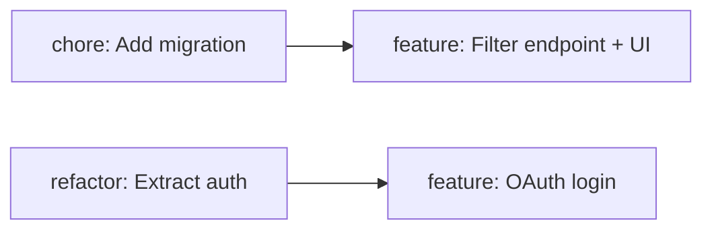

# Task Breakdown

Take user stories — from a `story-decomposition` output or a standalone description — and break them into concrete, PR-scoped development tasks. Each task represents the smallest useful and independently shippable change.

This skill is the final step in the shai-product discovery pipeline:

```
idea-evaluation → feature-mapping → story-decomposition → [task-breakdown]
```

Each task gets its own `{slug}.task.md` file in `docs/tasks/`, ready for a developer or AI agent to pick up and implement as a single PR.

## Core Principles

These rules are non-negotiable — they define what a "good task" looks like in this system:

1. **1 task = 1 PR = 1 change type.** A task is either a `feature`, `refactor`, `chore`, or `fix`. Never mix types in one task. If a story needs new infrastructure before the feature can land, that's a separate `chore` or `refactor` task.

2. **Smallest useful change.** Each task must be independently deployable and add value (or unblock value). "Add a button that does nothing" is not useful. "Add the API endpoint that the button will call" is — it's testable, reviewable, and unblocks the next task.

3. **1 story → 1 to 4 tasks.** If you need more than 4 tasks, the story is probably too big — push back and suggest splitting the story. If a story maps to exactly 1 task with no prep work, that's fine too.

4. **Vertical over horizontal — unless repos are separate.** For monorepos, prefer tasks that slice through all layers (API + UI + tests) in a thin vertical cut. For independent repositories (backend and frontend are separate repos), use horizontal tasks scoped to a single repo.

## When to Use

- User has stories (`.story.md` files) and wants to plan implementation tasks
- User describes a user story and wants it broken into PRs
- User asks "what tasks do I need for this story?"
- User wants to plan sprints or estimate implementation effort
- User wants to prepare work for AI agent sessions (each task = one session)
- As the fourth step in the shai-product pipeline (after `story-decomposition`)

## Task File Format

Each task is a separate Markdown file: `docs/tasks/{slug}.task.md`

```markdown
---
id: T-001
storyId: S-001
type: feature
layer: fullstack
effort: M
status: 🔴
dependencies: []
---

# {Task title}

> {One-sentence summary of what this task delivers and why it matters.}

## What to Do

- {Concrete implementation step 1}
- {Concrete implementation step 2}
- {Concrete implementation step 3}

## Acceptance Criteria

- [ ] {Observable, testable criterion 1}
- [ ] {Observable, testable criterion 2}
- [ ] {Observable, testable criterion 3}

## PR Template

**Title**: `{type}({scope}): {short description}`

**Description**:
> {2-3 sentence PR description explaining the change, why it's needed, and what it enables.}
>
> Story: S-001 — {story title}
> Task: T-001

## Notes

- {Technical consideration, gotcha, or dependency detail — optional}
```

### Metadata Fields

| Field          | Required | Values                                              | Description                                                        |
| -------------- | -------- | --------------------------------------------------- | ------------------------------------------------------------------ |
| `id`           | Yes      | T-001, T-002...                                     | Global sequential ID across all stories                            |
| `storyId`      | Yes      | S-001                                               | Parent story reference from story-decomposition                    |
| `type`         | Yes      | `feature` / `refactor` / `chore` / `fix`            | PR change type — one type per task, never mixed                    |
| `layer`        | Yes      | `backend` / `frontend` / `fullstack`                | Which part of the stack this task touches                          |
| `effort`       | Yes      | `S` / `M` / `L`                                     | T-shirt size: S ≈ hours, M ≈ a day, L ≈ 2-3 days                  |
| `status`       | Yes      | 🔴 / 🟡 / 🟢                                        | Not started / In progress / Done                                   |
| `dependencies` | Yes      | `[T-001]` or `[]`                                   | Task IDs that must be completed first. Empty array = no blockers   |

### Type Definitions

| Type       | When to use                                                                     | Examples                                                     |
| ---------- | ------------------------------------------------------------------------------- | ------------------------------------------------------------ |
| `feature`  | Adds user-facing value or a new capability                                      | New API endpoint, UI component, business logic               |
| `refactor` | Restructures existing code to prepare for or improve a feature. No new behavior | Extract interface, rename module, reorganize folder structure |
| `chore`    | Infrastructure, config, CI/CD, dependency updates. No behavior change           | Add DB migration, configure linter, update package versions  |
| `fix`      | Corrects a defect discovered during breakdown or implementation                 | Fix broken validation, correct data mapping                  |

### Naming Convention

The filename `{slug}` should be:

- Lowercase, hyphenated
- 2-5 words describing what the task does
- Prefixed with the type: `feature-`, `refactor-`, `chore-`, `fix-`
- Examples: `chore-add-users-table.task.md`, `feature-login-endpoint.task.md`, `refactor-extract-auth-service.task.md`

## Workflow

### Progress Reporting (mandatory)

At the start of each workflow step, output a progress indicator in bold blue:

**🔹 Step M/N — {Step title}**

### Step 1: Ingest the Input

Determine the input source and load context.

**Option A — Pipeline input (`.story.md` files):** Read story files from `docs/stories/`. Check `docs/stories/stories.md` for the story index if the user doesn't specify files. Extract:

- Story ID, title, user story statement
- BDD acceptance criteria (these inform task acceptance criteria)
- Feature reference and priority
- Implementation details (if present — these hint at required tasks)

Confirm with the user:

> "I've loaded {N} stories. Which ones should I break into tasks — all of them, or a specific subset?"

**Option B — Standalone input:** If no `.story.md` is provided, gather:

- What's the user story? (statement + acceptance criteria)
- What's the tech stack? (to determine layer and breakdown style)
- Is this a monorepo or separate repos? (to choose vertical vs horizontal)

### Step 2: Detect Breakdown Strategy

Analyze the workspace to determine whether to use vertical or horizontal task decomposition.

**Detection heuristic:**

1. Check if the workspace contains both backend and frontend code (look for `src/`, `api/`, `server/`, `client/`, `app/`, `web/`, `packages/`).
2. If backend and frontend coexist in one repo → **monorepo → vertical breakdown**.
3. If the workspace is clearly one layer only (just an API, just a UI) → **independent repo → horizontal breakdown**.
4. If uncertain, ask the user.

Report the detection result:

> "This looks like a **monorepo** — I'll use **vertical slicing** (each task cuts through backend + frontend in a thin slice). Override?"

or:

> "This looks like a **standalone backend** repo — I'll use **horizontal tasks** scoped to this repo only. Frontend tasks would be planned separately. Override?"

### Step 3: Decompose Stories into Tasks

For each story, identify the tasks. Think about what a developer needs to do, in what order, to implement the story.

**Decomposition heuristic — the Prep→Build→Wire pattern:**

For each story, ask:

1. **Prep** — Does anything need to exist first that doesn't yet? (DB migration, new module, interface extraction, config change) → `chore` or `refactor` task
2. **Build** — What's the core logic / UI / endpoint that delivers the story's value? → `feature` task(s)
3. **Wire** — Does anything need to be connected, integrated, or cleaned up? → Usually part of the feature task, but sometimes a separate `chore`

**Vertical breakdown (monorepo):**
Slice thin. Each task delivers a narrow but full-stack slice:

```
Story: "As a user, I want to filter products by category"

T-001 chore: Add category column to products table + migration
T-002 feature: Filter products by category (API endpoint + UI filter dropdown + tests)
```

Not:
```
T-001: Build backend filter endpoint
T-002: Build frontend filter UI
T-003: Connect frontend to backend
```

**Horizontal breakdown (separate repos):**
Scope to a single repo. Tasks are self-contained within their layer:

```
Story: "As a user, I want to filter products by category"

Backend repo tasks:
T-001 chore: Add category column to products table + migration
T-002 feature: GET /products?category={id} endpoint + tests

Frontend repo tasks:
T-003 feature: Category filter dropdown + integration with API + tests
```

**Sizing check:** Each task should be completable in one focused session (hours to ~2 days). If it feels bigger, split it. If a story generates more than 4 tasks, the story might be too large — flag it:

> "Story S-003 is decomposing into 6 tasks. Consider splitting it into two smaller stories. Suggested split: ..."

Present the task list per story before writing files:

```
## Story: S-001 — {Story Title}

Tasks identified:
1. T-001 [chore/S]: {Title} — {one-line summary}
2. T-002 [feature/M]: {Title} — {one-line summary}
   └── depends on: T-001
```

Ask the user to confirm, add, or remove tasks before writing the full files.

### Step 4: Write Task Files

For each confirmed task, generate the `.task.md` file.

**Writing "What to Do":**

Be specific enough that a developer (or AI agent) can start working without re-reading the story. Include:

- Concrete file paths or module names when known
- Specific API routes, DB tables, or UI components
- What to test and how

Avoid vague instructions:
- ✅ "Add `category_id` foreign key to `products` table with a migration. Index the column."
- ❌ "Update the database schema."

**Deriving acceptance criteria from BDD scenarios:**

Map the story's BDD scenarios to task-level criteria. The story says WHAT the user sees; the task says WHAT the code must do:

- Story BDD: "GIVEN a user on the dashboard WHEN they apply a date filter THEN only filtered data shows"
- Task AC: `[ ] GET /metrics?from=&to= returns filtered results` + `[ ] DateFilter component calls the API on selection change`

**Writing PR templates:**

Use conventional commit format for the PR title:
- `feat(products): add category filter endpoint`
- `refactor(auth): extract token validation into middleware`
- `chore(db): add products.category_id migration`
- `fix(cart): correct discount calculation for bulk orders`

The PR description should explain the change in 2-3 sentences, reference the story, and mention what the next task in the chain is (if any).

### Step 5: Generate Tasks Index

After writing all task files, create or update `docs/tasks/tasks.md` — a reference index listing all tasks.

```markdown
# Tasks

Index of all development tasks.

| ID    | Task          | Type    | Layer     | Effort | Story   | Story ID | Status | Dependencies | File                                   |
| ----- | ------------- | ------- | --------- | ------ | ------- | -------- | ------ | ------------ | -------------------------------------- |
| T-001 | {Task title}  | chore   | backend   | S      | {title} | S-001    | 🔴     | —            | [{slug}.task.md]({slug}.task.md)       |
| T-002 | {Task title}  | feature | fullstack | M      | {title} | S-001    | 🔴     | T-001        | [{slug}.task.md]({slug}.task.md)       |
| ...   |               |         |           |        |         |          |        |              |                                        |

**Total tasks**: {N} ({feature count} feature, {refactor count} refactor, {chore count} chore, {fix count} fix)
**Stories covered**: {N}
**Breakdown strategy**: {Vertical / Horizontal}
```

If `tasks.md` already exists, append new rows to the existing table — don't overwrite previous entries.

### Step 6: Review & Handoff

Present the full output to the user:

1. Task count summary per story (and per type)
2. Dependency graph (if tasks have dependencies)
3. Suggested implementation order
4. Full content of each `.task.md` file

**Dependency graph (when tasks have dependencies):**



**Suggested implementation order:**

Present tasks in the order they should be implemented:

```
## Implementation Order

1. T-001 [chore/S] — {title} (no dependencies, unblocks T-002)
2. T-003 [refactor/S] — {title} (no dependencies, unblocks T-004)
3. T-002 [feature/M] — {title} (after T-001)
4. T-004 [feature/M] — {title} (after T-003)

Tasks 1+2 can be done in parallel.
```

Ask:

> "Tasks complete! {N} tasks across {M} stories. Each task is one PR. Ready to start implementing, or do you want to adjust anything?"
>
> "Tip: Use **`/shai-pr-preparation`** (C-S09) when you've finished implementing a task to generate the PR description and run pre-submission checks."

## Gotchas

- **Tasks ≠ stories.** "As a user, I want to filter by date" is a story. "Add date filtering to GET /products endpoint" is a task. Tasks are developer-facing, not user-facing.
- **Don't over-decompose.** 1 story → 1-4 tasks. If a story needs 5+ tasks, the story should be split, not the tasks made smaller. Push back on the story, not the constraint.
- **Prep tasks are first-class.** A `refactor` or `chore` that unblocks a feature is a real deliverable, not overhead. It gets its own PR, its own review, and its own acceptance criteria.
- **Vertical slicing means thin, not shallow.** A vertical task touches all layers but does one small thing. "Add category filter" = one thin vertical slice (migration + endpoint + UI + test). Not "build entire backend" + "build entire frontend."
- **Horizontal is the exception, not the default.** Only use horizontal breakdown when backend and frontend are genuinely in different repositories with different deploy pipelines. If they're in the same repo, always go vertical.
- **PR types don't mix.** If a task requires both a refactor and a new feature, split into two tasks: a `refactor` prep task and a `feature` task that depends on it. Clean separation makes reviews faster and reverts safer.
- **Task IDs are global.** T-001, T-002... across all stories, not per-story. This avoids ambiguity when referencing tasks from PRs or other contexts.
- **Effort is T-shirt, not hours.** S = a few hours of focused work. M = roughly a day. L = 2-3 days. Anything bigger than L means the task should be split. Don't estimate in hours — it creates false precision.
- **Dependencies should be sparse.** Most tasks in a story depend on at most one prep task. If you're creating chains of 4+ dependent tasks, the decomposition is too fine-grained.
- **The PR template is a starting point.** Actual PR descriptions should be written (or refined) after implementation with `/shai-pr-preparation` (C-S09), not copy-pasted blindly from the task file.
