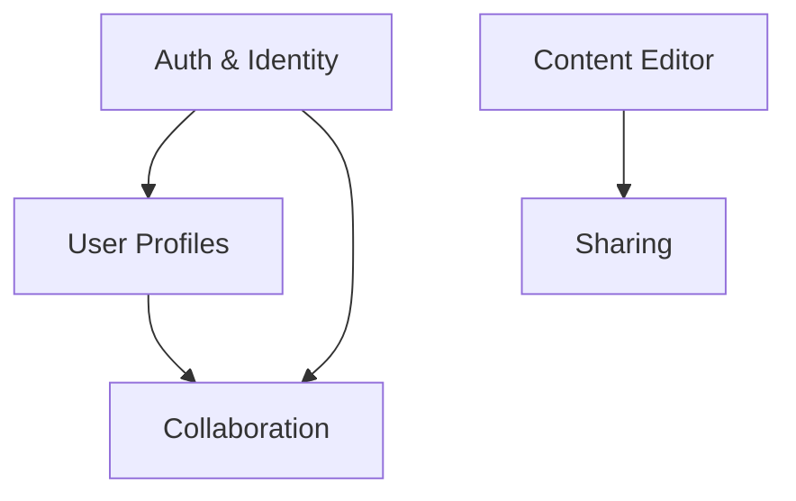

# Feature Mapping

Take raw product capabilities — from a `shai-idea-evaluation` report or a
standalone idea description — and map them into a structured, domain-grouped
feature set. The output is a single `{name}.features.md` file with a reference
table at the top and detailed feature cards below, ready for
`shai-story-decomposition` (V-S03).

This skill sits in the middle of the shai-product discovery pipeline:

```
shai-idea-evaluation → [shai-feature-mapping] → shai-story-decomposition → shai-task-breakdown
```

The goal is to turn vague capabilities into features that are concrete enough
to decompose into stories, but not so detailed that they prescribe implementation.
Think "what the product does" — not "how the code works."

## When to Use

- User has raw capabilities from `shai-idea-evaluation` and wants to formalize them
- User describes a product idea and wants to map its features directly
- User asks "what features do we need for X?"
- User wants to organize capabilities into domain areas
- User wants to prioritize features with RICE scoring
- User wants a dependency graph between features
- As the second step in the shai-product pipeline (after `shai-idea-evaluation`,
  before `shai-story-decomposition`)

## Workflow

### Progress Reporting (mandatory)

At the start of each workflow step, output a progress indicator in bold blue:

**🔵 Step M/N — {Step title}**

where M is the current step number and N is the total number of steps in the
workflow. This is mandatory for every step — never skip it.

### Step 1: Ingest the Input

Determine the input source and load context.

**Option A — Pipeline input (`.idea.md` file):**
Read the idea evaluation report. Extract:
- Core Concept (problem, solution, why now)
- Target personas
- User Journey Map
- Capabilities list (the raw material)
- MoSCoW priorities (initial signal, not final)
- Competitive landscape and killer feature
- Technical feasibility signals

Confirm with the user:
> "I've loaded the idea evaluation for **{idea name}**. It lists {N} capabilities
> across {M} domains. Let me review these with you before mapping."

**Option B — Standalone input (description or conversation):**
If no `.idea.md` is provided, gather the essentials:
- What's the product idea? (one-liner)
- Who are the primary users? (1-2 personas)
- What are the must-have capabilities? (brainstorm list)

Use `vscode/askQuestions` for structured choices where helpful.

### Step 2: Interview — Validate & Expand

This is a full conversation round to validate the input and surface features
the user hasn't thought of yet. Ask at least 10 questions, drawn from these
categories. Adapt based on answers — don't just fire a list.

**Capability validation:**

| #   | Question                                                                                                                              |
| --- | ------------------------------------------------------------------------------------------------------------------------------------- |
| 1   | "Looking at these capabilities, which ones feel most core to the product's identity? If you had to ship only 3, which would they be?" |
| 2   | "Are there any capabilities here that feel like they belong in a v2 or v3, not the first version?"                                    |
| 3   | "Which capability scares you the most technically? Which feels trivially easy?"                                                       |

**Domain discovery:**

| #   | Question                                                                                                      |
| --- | ------------------------------------------------------------------------------------------------------------- |
| 4   | "How would you naturally group these capabilities? What 'areas' of the product do you see?"                   |
| 5   | "Is there a domain that feels underrepresented — something the idea evaluation missed?"                       |
| 6   | "Are there administrative or operational features (settings, billing, analytics) that need their own domain?" |

**Gap analysis:**

| #   | Question                                                                                                |
| --- | ------------------------------------------------------------------------------------------------------- |
| 7   | "What does the user do on their very first visit? Is there an onboarding domain?"                       |
| 8   | "How do users collaborate or share? Is there a social/collaboration domain?"                            |
| 9   | "What happens when things go wrong — errors, edge cases, abuse? Do we need a safety/moderation domain?" |

**Competitive edge:**

| #   | Question                                                                                                                  |
| --- | ------------------------------------------------------------------------------------------------------------------------- |
| 10  | "Which feature would make a competitor's user switch to your product? What's the 'can't-get-this-anywhere-else' feature?" |
| 11  | "Are there features that competitors have that you deliberately want to skip? What's your 'anti-feature'?"                |

**Cross-cutting concerns:**

| #   | Question                                                                                                         |
| --- | ---------------------------------------------------------------------------------------------------------------- |
| 12  | "Are there cross-cutting capabilities (auth, notifications, search, analytics) that multiple domains depend on?" |
| 13  | "Does the product need an API or integration layer for third-party tools?"                                       |

After the interview, summarize what changed:
> "Based on our conversation, I'm adding {N} new features, moving {M} to a later
> phase, and creating a new **{domain}** domain. Here's the updated scope."

### Step 3: Domain Mapping

Group all validated capabilities into domain areas. A domain is a cohesive area
of the product that owns a set of related features.

**Guidelines for domain boundaries:**
- Each domain should own 3-8 features (fewer = merge with another, more = split)
- Domains should be recognizable to a non-technical stakeholder
- Cross-cutting concerns (auth, notifications, search) get their own domain
- Use names that describe what the domain does, not how it's built
  - ✅ "Collaboration", "Content Management", "Analytics"
  - ❌ "WebSocket Module", "Database Layer", "API Gateway"

Present the domain map to the user for feedback before proceeding:

```
## Domain Map

| Domain     | Features | Description                             |
| ---------- | -------- | --------------------------------------- |
| {Domain 1} | {N}      | {What this area of the product handles} |
| {Domain 2} | {N}      | {What this area of the product handles} |
| ...        | ...      | ...                                     |
```

### Step 4: Web Research per Domain

For each domain, search the web to validate features against industry best
practices and competitor patterns. This grounds the feature map in reality.

**What to look for per domain:**
- Do leading products in this space have similar features?
- Are there standard patterns or table-stakes features we're missing?
- Are there innovative approaches we should consider?
- What are common pitfalls in this domain?

Keep research focused — 1-2 searches per domain, not a full market study.
Summarize findings briefly in each domain's section of the output.

### Step 5: Feature Cards

For each feature, create a structured card. Features get sequential IDs
(F-001, F-002, ...) assigned in domain order.

**Feature card format:**

```markdown
### F-{NNN}: {Feature Name}

**Domain**: {Domain name}
**MoSCoW**: {Must / Should / Could / Won't}
**RICE Score**: {score} (R:{reach} × I:{impact} × C:{confidence} / E:{effort})

{2-3 sentence description of what this feature does and why it matters.}

**Acceptance signals:**
- {Observable behavior 1 — how you know this feature works}
- {Observable behavior 2}
- {Observable behavior 3}

**Depends on**: {F-NNN, F-NNN} or "None"
**Enables**: {F-NNN, F-NNN} or "—"
```

**RICE scoring guide:**

| Factor         | Scale                  | Description                                                                |
| -------------- | ---------------------- | -------------------------------------------------------------------------- |
| **Reach**      | 1-10                   | How many users/sessions does this affect per quarter? (1=few, 10=everyone) |
| **Impact**     | 0.25 / 0.5 / 1 / 2 / 3 | How much does this move the needle per user? (0.25=minimal → 3=massive)    |
| **Confidence** | 0.5 / 0.8 / 1.0        | How sure are we about these estimates? (0.5=low → 1.0=high)                |
| **Effort**     | 1-10                   | Person-weeks of work (1=trivial → 10=quarter-long project)                 |

Formula: `(Reach × Impact × Confidence) / Effort`

Be opinionated about scores — don't hedge everything at "medium." If a feature
is a game-changer, give it a 3 impact. If it's a nice-to-have, give it a 0.5.

### Step 6: Dependency Graph

After all features are defined, build an explicit dependency graph. This shows
which features must exist before others can work.

**Format — Mermaid diagram:**



**Rules for dependencies:**
- Only include true technical or logical dependencies, not "nice to have first"
- A feature depends on another if it literally cannot function without it
- Avoid circular dependencies — if you find one, the features need restructuring
- Cross-cutting features (auth, core data model) naturally sit at the root

After presenting the graph, flag any features that are "blocked" (have unmet
dependencies) and any that are "enablers" (many features depend on them).

### Step 7: Assemble the Feature Map

Compile everything into a single `{name}.features.md` file. The structure is:

1. **Feature Reference Table** — summary of all features with IDs, domains,
   MoSCoW, RICE scores, and status
2. **Domain sections** — grouped feature cards with domain context
3. **Dependency graph** — the Mermaid diagram
4. **Implementation roadmap** — suggested build order based on dependencies
   and RICE scores

Save the file in the same directory as the `.idea.md` (if pipeline input) or
in the current workspace root (if standalone).

Present the full output to the user and ask:
> "Feature map complete! Ready to pass this to **`/shai-story-decomposition`**,
> or do you want to adjust anything?"

**Optional architect consult:**
> "Some features touch complex technical territory. Want me to suggest calling
> **`@shai-architect`** (C-A01) for technical feasibility on the riskier ones?"

## Output Template

Use this structure for the `{name}.features.md` file:

```markdown
# {Idea Name} — Feature Map

> {One-liner: what features this product needs and how they're organized.}

## Feature Reference

| ID    | Feature | Domain   | MoSCoW | RICE    | Depends On | Status |
| ----- | ------- | -------- | ------ | ------- | ---------- | ------ |
| F-001 | {name}  | {domain} | Must   | {score} | —          | Mapped |
| F-002 | {name}  | {domain} | Must   | {score} | F-001      | Mapped |
| F-003 | {name}  | {domain} | Should | {score} | F-001      | Mapped |
| ...   |         |          |        |         |            |        |

**Total features**: {N} ({Must count} Must, {Should count} Should,
{Could count} Could, {Won't count} Won't)

## Domain: {Domain Name}

> {1-2 sentence domain description. What area of the product this covers
> and why it exists as a distinct domain.}

**Industry context**: {Brief web-research insight — what leading products
do in this domain, or common patterns to be aware of.}

### F-001: {Feature Name}

**Domain**: {Domain name}
**MoSCoW**: Must
**RICE Score**: 12.0 (R:8 × I:3 × C:1.0 / E:2)

{Description of what this feature does and why it matters.}

**Acceptance signals:**
- {Observable behavior 1}
- {Observable behavior 2}
- {Observable behavior 3}

**Depends on**: None
**Enables**: F-002, F-005

### F-002: {Feature Name}

...

_(Repeat for all features in this domain.)_

## Domain: {Domain Name 2}

...

_(Repeat for all domains.)_

## Dependency Graph

{Mermaid diagram showing feature dependencies.}

**Enabler features** (many others depend on these — build first):
- F-001: {name} — depended on by {N} features
- F-00N: {name} — depended on by {N} features

**Blocked features** (waiting on dependencies):
- F-00N: {name} — blocked by {list}

## Implementation Roadmap

Suggested build order based on dependency chains and RICE scores.

### Phase 1: Foundation (Must-have enablers)
| Order | ID    | Feature | RICE    | Rationale              |
| ----- | ----- | ------- | ------- | ---------------------- |
| 1     | F-001 | {name}  | {score} | {Why build this first} |
| 2     | F-00N | {name}  | {score} | {Why}                  |

### Phase 2: Core Experience (Must-haves)
| Order | ID  | Feature | RICE | Rationale |
| ----- | --- | ------- | ---- | --------- |
| ...   |     |         |      |           |

### Phase 3: Differentiation (Should-haves with high RICE)
| Order | ID  | Feature | RICE | Rationale |
| ----- | --- | ------- | ---- | --------- |
| ...   |     |         |      |           |

### Phase 4: Polish (Could-haves)
| Order | ID  | Feature | RICE | Rationale |
| ----- | --- | ------- | ---- | --------- |
| ...   |     |         |      |           |

## Next Steps

This feature map is ready for **`/shai-story-decomposition`** — pass it as
input to break features into user stories.

For architecture decisions on technically complex features, consult
**`@shai-architect`** (C-A01).
```

## Gotchas

- **Features ≠ implementation tasks.** "User can share a board via link" is a
  feature. "Set up WebSocket server" is a task. Stay at the user-facing level.
- **Don't inflate RICE scores.** Be honest. A feature that affects 50 users
  per quarter gets Reach 2, not 8. Overly optimistic scores defeat the purpose.
- **Domain count sweet spot is 4-7.** Fewer means you're lumping unrelated
  things together. More means you're splitting hairs. If you hit 8+ domains,
  reconsider boundaries.
- **Dependencies should be sparse.** If every feature depends on 3 others, the
  graph is too tangled. Most features should have 0-2 dependencies. If not,
  the feature boundaries need work.
- **MoSCoW from idea eval is a starting point, not gospel.** The interview may
  reveal that a "Could" is actually a "Must" (or vice versa). Re-evaluate.
- **Cross-cutting features are easy to forget.** Auth, error handling,
  notifications, search, settings — these don't come from user stories but
  everything depends on them. Ask about them explicitly.
- **Don't skip web research.** 5 minutes of validation per domain saves hours
  of building the wrong thing. Look for table-stakes features you're missing.
- **The dependency graph reveals build order.** Features with no dependencies
  and many dependents are your Phase 1. Features with many dependencies are
  your Phase 3+. Let the graph guide the roadmap, don't force it.
- **Keep it fun.** This is product discovery, not a compliance audit. Be
  opinionated, have opinions about which features are exciting vs. boring,
  and help the user see the shape of their product.
